---

<link href="https://cdn.rawgit.com/knsv/mermaid/6.0.0/dist/mermaid.css" rel="stylesheet" />
---
# Visual Flowchart 

This is the visual representation of the entire Staple Assembly process 

## Traditional Staple Operation

```mermaid
 graph TD


            a1[Close Valve]
            a1-1[Turn on Rough Pumping]
            a1-2[Pressure is less than 1e-1 mbar]
            a1-3[Stop Roughing: Connect to the Pump]
            %% a2[Start Pump <br> CC:❌ M:✅]

            a3[Coarse Alighment using Stepper Motor <br> CC:✅ M:✅]
            a4[Move Microscope to the top of the sample <br> CC:✅ M:❌]
            a5[Focus on the Chip with Maximum Magnification <br> CC:✅ M:✅]
            a6[Align the Microscope on the Chip <br> CC:✅ M:✅]
            a7[Focus on the CAD <br> CC:✅ M:✅]
            a8[Aligh the CAD Roughly <br> CC:✅ M:✅]
            a9[Move the Microscoper to 200 microns above the chip <br> CC:✅ M:✅]
            a10[lower the cad until they will reach 200 microns above the chip and in the focus of the microscope <br>
            CC:✅ M:✅]
            a11[Start the Stapling <br> CC:✅ M:✅]
            a12[TouchDown <br> CC:✅ M:❌]
            a13[Chip Health <br> CC:✅ M:❌]
            a14[Cut the Source Side <br> CC:✅ M:✅]
            a15[Cut the Drain Side <br> CC:✅ M:✅]
            a16[I-V Curve of Source- Drain <br> CC:✅ M:❌]
            a17[Gate Dependense <br> CC:✅ M:❌]
            a18[Remove the CAD <br> CC:✅ M:✅]

            subgraph Valve
            a1
            a1-1
            a1-2
            a1-3
            end
            class Valve sand

            subgraph Stepper-Motor
            a3
            end
            class Stepper-Motor lavender

            subgraph ZABER-Motor
            a4
            a6
            end
            class ZABER-Motor mint

            subgraph PiezoMotor
            a8
            a10
            end
            class PiezoMotor ocean


            subgraph Microscope
            a5
            a7
            a9
            end
            class Microscope rose


            subgraph Piezo/SMU1
            a11
            a12
            end
            class Piezo/SMU1 blush

            subgraph SMU1
            a13
            a14
            a15
            a16
            end
            class SMU1 denim


            subgraph SMU2
            a18
            end
            class SMU2 sand

            a1

            a1-3
            --> a3
            --> a4
            --> t2{Is this Operation Sussesful?}
            t2 --> |Yes| a5
            t2 --> |No| a4
            a5
            --> a6
            --> a7
            --> a8
            --> a9
            --> a10
            --> a11
            --> a12
            --> a13
            --> a14
            --> a15
            --> a16
            --> a17
            --> a18

            %% For SubGraph Coloring and Category %%
            
```

## Pick And Place Operation

