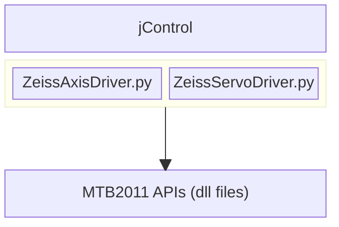

# OverView

The most used Repositories of the Nano-Assembly team :

## [https://github.com/c12qe/jControl/](https://github.com/c12qe/jControl/)

### 1. jDrivers

 Contains Drivers for equipments:

1. AxioCam 
2. [Zeiss Drivers](https://www.notion.so/OverView-20eef1171c0e809e941bc3b3bb8d059c?pvs=21)
3. K2400
4. SMD3

## AxioCam

```jsx
├── AxioZoom
│   ├── AxioCamControl_ErrorCodes.py
│   ├── AxioCamControl_original.py
│   ├── AxioCamControl.py
│   ├── AxioZoomApi
│   │   └── include
│   │       ├── mcam_zei_ex.h
│   │       ├── mcam_zei.h
│   │       └── test
│   ├── C12 Workbench.mtb
│   └── MTB Api
│       ├── MTBAPI.CHM
│       ├── MTBAPI.chw
│       ├── MTBApi.dll
│       └── MTBAPI.TLB
├── AxioZoomDriver_Prototype.py

```

AxioCam 305 used as the Microscope Camera. Drivers related to AxioCam 

- **‘AxioCamControl.py’ - Initialises the Camera ‘long McammLibInit(bool ipOnly)’ - using WINAPI DLL files , Get Images (Buffer) , Close Cams.**
    - ipOnly = True if library is only used for image (post-)processing and not for controlling the camera.
- ‘**AxioCamControl_ErrorCodes.py' —> AxioCam Exceptions like white error, no camera error etc**
- **‘AxioZoomDriver_Prototype.py’ —> Dependent on the ZEISS library (MTB)**

```
  - -> 1. Start connection to MTB 
        2. Login to MTB 
        3. Get the root node
        4. Find the number of devices that are available on the microscope
        5. Create Empty device list
        6. A list of availabele components 
```

## Zeiss Drivers



MTB2011 - Carl Zeiss MicroToolBox 2011 - provides an API (Application Programming Interface), documentation, sample programs and debug tools for users to write their own software for automated microscope control, image acquisition, and experimental workflows

file:///Users/saptarshinag/Downloads/mtb2011-how_to_start%20(1).pdf

```markdown
## Zeiss Axis/Servo Driver

- Class Axis 
    Query Instrument
        - Available Position Units
        - Available Speed Units
        - Position Units
        - Speed Units
        - Position
        - Speed
        - Reference Position
        - Relative Position
        - Software Limit
        - Software Limit Enabled
        - Valid Range
        - Step Size
        - Typical Deviation
        - Max Deviation
```

<aside>
💡

The Big Diff between “Zeiss Axis Driver” vs “Zeiss Servo Driver” is use of API 

- Zeiss Axis Driver - MTB.Api.IMTBAxis(component)
- Zeiss Servo Driver - MTB.APi.IMTBContinual(component)
</aside>

## MTB.Api.IMTBAxis vs. MTB.API.IMTBContinual: Key Differences

These interfaces are part of ZEISS's MTB2011 API for microscope control, serving distinct roles in hardware interaction. Below is a structured comparison:

## **MTB.Api.IMTBAxis**

- **Purpose**: Controls motorized axes (e.g., microscope stage, focus drive, or filter wheel positions).
- **Key Functions**:
    - `SetPosition()`: Moves the axis to a specified position (absolute or relative).
    - `GetPosition()`: Retrieves the current position.
    - `Calibrate()`: Performs axis calibration.
    - `Stop()`: Halts movement immediately.
- **Usage Example**:
    
    `csharpIMTBAxis stageAxis = (IMTBAxis)m_Root.GetComponent("MTBStageX");
    stageAxis.SetPosition(1000, "µm", MTBCmdSetModes.Synchronous);`
    
- **Events**:
    - `PositionChanged`: Triggered during movement.
    - `PositionSettled`: Fired when the axis reaches its target.
    - `BusyChanged`: Indicates movement status.

## **MTB.API.IMTBContinual**

- **Purpose**: Manages continuous or analog-controlled components (e.g., light intensity, temperature, or analog sensors).
- **Key Functions**:
    - `SetValue()`: Adjusts the continuous parameter (e.g., LED brightness).
    - `GetValue()`: Reads the current value.
    - `Start()`/`Stop()`: Controls ongoing processes (e.g., temperature ramping).
- **Usage Example**:
    
    `csharpIMTBContinual lightControl = (IMTBContinual)m_Root.GetComponent("MTBLightIntensity");
    lightControl.SetValue(75, "%", MTBCmdSetModes.Asynchronous);`
    
- **Events**:
    - `ValueChanged`: Reports updates to the controlled parameter.
    - `BusyChanged`: Signals active adjustments.

## Comparison Table

| Feature | IMTBAxis | IMTBContinual |
| --- | --- | --- |
| **Control Type** | Discrete positions (motorized axes) | Continuous/analog parameters |
| **Primary Use Cases** | Stage movement, focus, filter wheels | Light intensity, temperature, sensors |
| **Key Methods** | `SetPosition()`, `GetPosition()` | `SetValue()`, `GetValue()` |
| **Movement Commands** | Supports units (µm, mm) | Uses percentages or raw analog values |
| **Event Focus** | Position updates | Value changes |

## Context from MTB2011 Documentation

- Both interfaces inherit from `IMTBBase`, sharing common methods like `StartMonitoring()` and event-handling mechanisms[1](https://www.zeiss.com/content/dam/rms/reference-master/service-support/downloads/micro-toolbox/mtb2011-how_to_start.pdf).
- The API emphasizes **event-driven programming** for both: avoid polling states and instead subscribe to events like `PositionChanged` (axis) or `ValueChanged` (continual)[1](https://www.zeiss.com/content/dam/rms/reference-master/service-support/downloads/micro-toolbox/mtb2011-how_to_start.pdf).
- Example workflows in the SDK demonstrate using `IMTBAxis` for stage automation and `IMTBContinual` for dynamic light adjustments during imaging[1](https://www.zeiss.com/content/dam/rms/reference-master/service-support/downloads/micro-toolbox/mtb2011-how_to_start.pdf).

For precise implementation details, refer to the MTB2011 API documentation and sample code provided in the SDK[1](https://www.zeiss.com/content/dam/rms/reference-master/service-support/downloads/micro-toolbox/mtb2011-how_to_start.pdf).

1. [https://www.zeiss.com/content/dam/rms/reference-master/service-support/downloads/micro-toolbox/mtb2011-how_to_start.pdf](https://www.zeiss.com/content/dam/rms/reference-master/service-support/downloads/micro-toolbox/mtb2011-how_to_start.pdf)
2. [https://www.impaxis-securities.com](https://www.impaxis-securities.com/)
3. [https://www.zeiss.com/microscopy/fr/service-assistance/telechargements/micro-toolbox.html](https://www.zeiss.com/microscopy/fr/service-assistance/telechargements/micro-toolbox.html)

### jClients, jServer & [jHeh.py](http://jHeh.py)

```jsx
 jControl-main
    └── jControl
        ├── jClient.py
        ├── jServer.py
        └── widgets
            └── jHeh.py
            
```


[https://docs.google.com/presentation/d/1o7ovWG0VocYEntYKUHPnzZYBLXDrNEZPQWhaZDFDYzM/edit?slide=id.g35fd99b28dd_0_122#slide=id.g35fd99b28dd_0_122](https://docs.google.com/presentation/d/1o7ovWG0VocYEntYKUHPnzZYBLXDrNEZPQWhaZDFDYzM/edit?slide=id.g35fd99b28dd_0_122#slide=id.g35fd99b28dd_0_122)

## SMD3 

Also Used in https://github.com/c12qe/assemblerGUI


[https://github.com/c12qe/assemblerGUI/blob/b92ab015bffe92f63c1a9b29cd11c9eb73e81281/src/SwanCoarseControlsWidget_v3.py](https://github.com/c12qe/assemblerGUI/blob/b92ab015bffe92f63c1a9b29cd11c9eb73e81281/src/SwanCoarseControlsWidget_v3.py)

```jsx

```

## K2400 

SourceMeter Source Measure Units (SMUs) - For precise Voltage and current measurement

[https://drive.google.com/file/d/1HkmQX5cdC8Mb4hkj4a23yBQF-InCottf/view](https://drive.google.com/file/d/1HkmQX5cdC8Mb4hkj4a23yBQF-InCottf/view)

```jsx
Keithley2400
Represents the Keithley 2400 SourceMeter and provides a high-level interface for interacting with the instrument.

# The Keithley package
from pymeasure.instruments.keithley import Keithley2400

    keithley = Keithley2400("GPIB::1")

    keithley.apply_current()                # Sets up to source current
    keithley.source_current_range = 10e-3   # Sets the source current range to 10 mA
    keithley.compliance_voltage = 10        # Sets the compliance voltage to 10 V
    keithley.source_current = 0             # Sets the source current to 0 mA
    keithley.enable_source()                # Enables the source output

    keithley.measure_voltage()              # Sets up to measure voltage

    keithley.ramp_to_current(5e-3)          # Ramps the current to 5 mA
    print(keithley.voltage)                 # Prints the voltage in Volts

    keithley.shutdown()                     # Ramps the current to 0 mA and disables output
```

# Query Instrument

1. Output On
2. SourceMode
3. Measure Mode -> Voltage, Current
4. Volatage Sent
5. CurrentSent
6. ComplianceSync
7.Beep
8. Error
9. Id

Stapler uses the K2450 rather than 2400

| Feature | Keithley 2400 | Keithley 2450 |
| --- | --- | --- |
| **Power Output** | 22 W | 20 W |
| **Current Range** | 10 pA – 1.05 A | 10 fA – 1.05 A |
| **Voltage Range** | 1 µV – 210 V | 10 nV – 210 V |
| **Ohms Range** | <2 Ω to >200 MΩ | <2 Ω to >200 MΩ |
| **Basic Accuracy (I, V, Ω)** | I: 0.025%, V: 0.012%, Ω: 0.04% | I: 0.020%, V: 0.012%, Ω: 0.04% |
| **Wideband Noise** | 4 mVrms typical | 2 mVrms typical |
| **Sweep Types** | Linear, Log, Custom, Source-Memory | Linear, Log, Dual Linear, Dual Log, Custom, Source-Memory (SCPI 2400 Mode) |
| **Embedded Scripting** | No | Yes (TSP scripting) |
| **Contact Check** | Yes | No |
| **Front Panel Interface** | Buttons and display | 5-inch capacitive touchscreen |
| **Front Panel USB Port** | No | Yes |
| **Memory Buffer** | 5,000 points | >250,000 points |
| **Reading Rate** | >2,000 rdgs/sec | >3,000 rdgs/sec |
| **Programming Interface** | GPIB, RS-232 | GPIB, USB 2.0, Ethernet (LXI) |
| **Command Language** | SCPI | SCPI & TSP |
| **Digital I/O** | 1 In / 4 Out | 6 lines |
| **Navigation Knob** | No | Yes |
| **Safety Interlock** | No | Yes |


