# Software Automation

## Top Level Operation 

```mermaid
graph TD
    %% User Interface Layer
    subgraph "User Interface Layer"
        User[("👤 User")]
        jHeh["🖥️ jHeh Main Window<br/>• Menu System<br/>• Widget Manager<br/>• Lifecycle Control"]
    end
    
    %% GUI Applications Layer
    subgraph "GUI Applications (Managed by jHeh)"
        jPlotter["📊 jPlotter<br/>• Data Visualization<br/>• Real-time Plotting<br/>• Analysis Tools"]
        jMonitor["📋 jMonitor<br/>• System Status<br/>• Channel Monitoring<br/>• Alerts"]
        CustomGUI["🔧 Custom GUIs<br/>• Experiment-specific<br/>• User Tools<br/>• Specialized Interfaces"]
    end
    
    %% Client Layer
    subgraph "Client Communication Layer"
        jWidget["🔌 jWidget<br/>• Client Connection<br/>• ZMQ Communication<br/>• Request/Response"]
        jClient1["📡 jClient (jHeh)"]
        jClient2["📡 jClient (jPlotter)"]
        jClient3["📡 jClient (jMonitor)"]
    end
    
    %% Network Communication
    subgraph "Network Layer"
        ZMQRouter["🔀 ZMQ Router<br/>Port: 60000<br/>Request/Response"]
        ZMQPublisher["📢 ZMQ Publisher<br/>Port: 60001<br/>Broadcast Updates"]
    end
    
    %% Server Core
    subgraph "jServer Core"
        jServer["🏭 jServer<br/>• Client Management<br/>• Resource Coordination<br/>• Measurement Orchestration<br/>• Thread Management"]
        ClientManager["👥 Client Manager<br/>• Registration<br/>• Authentication<br/>• Session Tracking"]
        MeasurementEngine["⚙️ Measurement Engine<br/>• Task Generation<br/>• Execution Control<br/>• Data Collection"]
    end
    
    %% Resource Management
    subgraph "Resource Management"
        ChannelManager["📊 Channel Manager<br/>• Channel Registry<br/>• Dependency Graph<br/>• Lock Management"]
        InstrumentManager["🔬 Instrument Manager<br/>• Driver Loading<br/>• Connection Control<br/>• Hardware Abstraction"]
    end
    
    %% Hardware Layer
    subgraph "Hardware Interface"
        Drivers["🔧 Instrument Drivers<br/>"]
        Hardware["⚡ Physical Instruments<br/>• SMU"]
    end
    
    %% Data Storage
    subgraph "Data Management"
        DataManager["💾 Data Manager (Jm)<br/>• File Generation<br/>• Data Serialization<br/>• Storage Management"]
        FileSystem["🗄️ File System<br/>• Measurement Data<br/>• Configuration Files<br/>• Log Files"]
    end
    
    %% User Interactions
    User --> jHeh
    jHeh --> jPlotter
    jHeh --> jMonitor
    jHeh --> CustomGUI
    
    %% Client Connections
    jHeh --> jWidget
    jWidget --> jClient1
    jPlotter --> jClient2
    jMonitor --> jClient3
    
    %% Network Communication
    jClient1 --> ZMQRouter
    jClient2 --> ZMQRouter
    jClient3 --> ZMQRouter
    ZMQRouter --> jServer
    jServer --> ZMQPublisher
    ZMQPublisher --> jClient1
    ZMQPublisher --> jClient2
    ZMQPublisher --> jClient3
    
    %% Server Internal Structure
    jServer --> ClientManager
    jServer --> MeasurementEngine
    jServer --> ChannelManager
    jServer --> InstrumentManager
    jServer --> DataManager
    
    %% Hardware Communication
    InstrumentManager --> Drivers
    Drivers --> Hardware
    
    %% Data Flow
    MeasurementEngine --> DataManager
    DataManager --> FileSystem
    
    %% Feedback Loops
    Hardware -.-> Drivers
    Drivers -.-> InstrumentManager
    InstrumentManager -.-> ChannelManager
    ChannelManager -.-> MeasurementEngine
    MeasurementEngine -.-> ZMQPublisher
    
    %% Styling
    classDef userLayer fill:#e1f5fe
    classDef guiLayer fill:#f3e5f5
    classDef clientLayer fill:#e8f5e8
    classDef networkLayer fill:#fff3e0
    classDef serverLayer fill:#ffebee,stroke:#1976d2,stroke-width:2px
    classDef resourceLayer fill:#f1f8e9
    classDef hardwareLayer fill:#fce4ec
    classDef dataLayer fill:#e0f2f1
    
    class User,jHeh userLayer
    class jPlotter,jMonitor,CustomGUI guiLayer
    class jWidget,jClient1,jClient2,jClient3 clientLayer
    class ZMQRouter,ZMQPublisher networkLayer
    class jServer,ClientManager,MeasurementEngine serverLayer
    class ChannelManager,InstrumentManager resourceLayer
    class Drivers,Hardware hardwareLayer
    class DataManager,FileSystem dataLayer
```

## Pick and Place Operations BreakDown

<table>
<thead>
<tr>
<th>Operation</th>
<th>Hardware</th>
<th>Human</th>
<th>Software (Present)</th>
</tr>
</thead>
<tbody>
<tr>
<td style="background-color:rgb(216, 192, 39); color: white;">Initialization</td>
<td style="background-color:rgb(216, 192, 39); color: white;"></td>
<td style="background-color:rgb(216, 192, 39); color: white;">Initialization</td>
<td style="background-color:rgb(216, 192, 39); color: white;"></td>
</tr>
<tr>
<td>Close Valve</td>
<td>Valve</td>
<td>Manual</td>
<td>Handled by a set of Relay Switches which are Switched ON/OFF Manually</td>
</tr>
<tr>
<td>Turn on Rough Pumping</td>
<td>Pump</td>
<td>Manual</td>
<td></td>
</tr>
<tr>
<td>Pressure is less than 1e-1mbar</td>
<td>Pump</td>
<td>Continuous monitor the pressureand check that it drops below (1e-1 mbar)before procedding</td>
<td></td>
</tr>
<tr>
<td>Stop Roughing connect to the pump</td>
<td>Pump</td>
<td>Manual</td>
<td></td>
</tr>
<tr>
<td>Upload Chip Based map</td>
<td>Used by the Matrix</td>
<td>Download maps from the databaseand upload the maps used to configure the matrix</td>
<td>Use the Matrix GUI to check each devices andits connections at each channels</td>
</tr>
<tr>
<td>Motor Calibaration</td>
<td>Zaber motor, Arun motor , Piezo motorsall gets to their pre set default coordinates</td>
<td>Manual</td>
<td>Move the Motor in Steps - either X, Y or Z direction through GUIs</td>
</tr>
<tr>
<td></td>
<td></td>
<td></td>
<td></td>
</tr>
<tr>
<td>Microscope Calibaration</td>
<td>Calibarate the Microscope to Zoom into the Cantilevel</td>
<td>Check for the best view possible of the FORK by adjusting the focus &amp; zoom level of the Microscope and the horizontal coordinates of the Axes (X-Y) through Zaber motor</td>
<td>Use Microscope's GUI to view to theexact location Manual operation</td>
</tr>
<tr>
<td style="background-color: #4CAF50; color: white;">PICK Operation</td>
<td style="background-color: #4CAF50; color: white;"></td>
<td style="background-color: #4CAF50; color: white;">PICK OPERATION</td>
<td style="background-color: #4CAF50; color: white;"></td>
</tr>
<tr>
<td>Cleaning</td>
<td>FORK: Send High voltage through the fingers of the fork toremove (burn up) any old tube</td>
<td>Remove any old/non-responsive Tubeon the FORK check manually on the Microscopeif the tube no longer exists</td>
<td></td>
</tr>
<tr>
<td>Course Alignment</td>
<td>FORK/Piezo motors, Cantilevel Alignment</td>
<td>Manually check if the chip and the FORKis in position</td>
<td>The Piezo Motors GUI are used to move the FORK in Stepsto reach the position of the tube</td>
</tr>
<tr>
<td>Pick Tubes</td>
<td>FORK goes to the designated coordinates of the cantilevelto pick up the Tubes</td>
<td>Go to the particular coordinates as mentioned</td>
<td></td>
</tr>
<tr>
<td>Anneling</td>
<td>FORK sending high voltage through the CNT so thatthe CNT gets detached from the fingers of the Cantilevel</td>
<td>Perform the I-V Sweep, Increase the voltage untilthe anneling event occurs -- Used to Check if theTube is caught in between the Tubes (As it glowes in vaccum)and also to clean the nanotube</td>
<td>JControl is used to capture theI-V measurements from the SMUand generates the plot</td>
</tr>
<tr>
<td>Current vs Coordinates</td>
<td>SMU , FORK/PIEZO, Cantilever</td>
<td>Manually go to the location of the Tube in thecantilevel. And check the I-V plot to check for succesulShorting of the fork and the CNT</td>
<td>Start the I-V measurement process and capture measurements</td>
</tr>
<tr>
<td>Testing: Succesful Pickup Operation</td>
<td>SMU , FORK/PIEZO</td>
<td>Observe the sudden Drop in Current in the I-V Plot and then raisingIndicating the operation as succesful</td>
<td>JControl is used to capture theI-V measurements from the SMUand generates the plot</td>
</tr>
<tr>
<td style="background-color:rgb(224, 117, 50); color: white;">PLACE Operation</td>
<td style="background-color:rgb(224, 117, 50); color: white;"></td>
<td style="background-color: #4CAF50; color: white;">PLACE OPERATION</td>
<td style="background-color: #4CAF50; color: white;"></td>
</tr>
<tr>
<td>Course alignment for assembly</td>
<td>FORK/PIEZO , ARUN</td>
<td>Checks if the Chip is in Position and FORK/PIEZOready to put the CNT on the Chip/Device</td>
<td>JControl is used to capture theI-V measurements from the SMUand generates the plot</td>
</tr>
<tr>
<td>Testing for Shorts</td>
<td>SMU, Matrix</td>
<td>Manually Checks the I-V if it shows any Shorts (Short Circuit)</td>
<td>JControl is used to capture theI-V measurements from the SMUand generates the plot</td>
</tr>
<tr>
<td>Testing for TouchDown</td>
<td>SMU, FORK</td>
<td>Check Manually that Is its Touching theSource-Drain Terminal perfectly</td>
<td></td>
</tr>
<tr>
<td>Anneling</td>
<td>SMU</td>
<td>The Fork makes contact with the Source-Drain Terminaland the Anneling is Done so that the CNTdisconnects from the FORK andconnects (Sticks) with the Source-Drain Terminal</td>
<td></td>
</tr>
<tr>
<td>Characterisation</td>
<td>SMU</td>
<td>Manually Checks the I-V plot, Gate contactsTo check if the CNT is detached from the FORK</td>
<td></td>
</tr>
</tbody>
</table>

## Software Operation: Under the Hood

